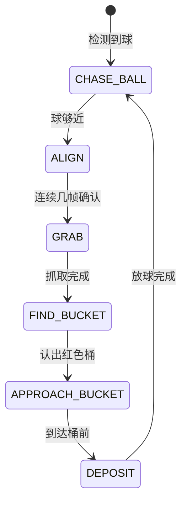

# 网球机器人上手指南

这份指南面向拿到小车硬件之后要动手做开发的人。内容按实际动手的顺序排列：先认识硬件，再准备开发环境，然后编译系统、制作 SD 卡、上电启动，最后让小车真正跑完一次"看到球、开过去、抓起来、放进桶里"的完整过程。每一步都给出可以照抄的命令和判断成功的方法。

机器人本体是同一台，主控板可以整块换成 RK3588 或 SG2002 两种，因此两条路线的编译、写卡、启动方式都不一样。凡是不同的地方都分开写清楚，相同的部分合并说明。

## 1. 认识这套硬件

动手之前先弄清楚机器人由哪些部分组成、两块主控板各自是什么、以及程序要操作哪些设备。这一节的内容决定了后面每一步该用哪条命令。

### 1.1 机器人本体的组成

机器人是一台四轮底盘小车，左右两侧各由一个编码电机差速驱动，底盘控制器是 ESP32-C3，电机驱动是 DRV8833 双路 H 桥，供电是锂电池加降压板。车上的机械臂是 ZP10D 舵机臂，视觉用普通的 USB 摄像头（UVC 协议），另有一个用于投放网球的桶。

这几部分通过不同接口接到主控板上：摄像头走 USB，底盘和机械臂各占一个串口。ESP32-C3 上跑的是自研固件，通过 UART 协议接收主控板发来的速度和方向指令，协议定义在 `hardware/esp32_base_control/PROTOCOL.md`。主控板跑 StarryOS 操作系统，用户态程序根据摄像头画面决定底盘怎么走、机械臂什么时候动。

主控板可以整块替换，这是这个项目的核心设计。同一台小车，换上 RK3588 板就是高算力版本，换上 SG2002 板就是低成本版本。两条路线共用底盘、机械臂、摄像头硬件，也用同一份训练出来的 YOLOv8n 模型，只在"主控板 + 推理链 + 用户态程序"上分叉。

### 1.2 两条平台路线

两块主控板的算力、模型格式和用户态程序语言都不同，选择哪一块取决于你对算力和成本的要求。下表把主要差别列在一起，便于对照。

| 对比项 | RK3588 路线 | SG2002 路线 |
| --- | --- | --- |
| 主控板 | Orange Pi 5 Plus | 荔枝派 Nano（Sipeed LicheeRV Nano）或 AKA-00 车板 |
| 芯片架构 | ARM64，8 核（4×A76 + 4×A55） | RISC-V 单核 C906 |
| AI 加速 | NPU，6 TOPS，三核 | TPU，0.5 TOPS（INT8） |
| 图像硬件加速 | RGA 缩放、JPU 硬解 JPEG | 无，图像处理全部走 CPU |
| 模型格式 | RKNN（用 rknn-toolkit2 转换） | cvimodel（用 CVITEK TPU-MLIR 转换） |
| 推理运行时 | librknnrt.so | libcviruntime / libcvikernel |
| 用户态程序 | C++ 写的 `tennis_app` | Rust 写的 `akars` |
| 系统库 | glibc | musl |
| 联网方式 | 无板载无线，靠有线网络 | 板载 AIC8800DC WiFi，可连热点也可自己开热点 |
| 定位 | 算力充足，适合跑完整自主流程 | 成本低、功耗低，适合 RISC-V 生态验证 |

两条路线的差别会一直贯穿到后面的编译和部署：RK3588 的程序用 glibc 工具链编译，SG2002 的用 musl 工具链交叉编译，两者不能混用——用错了会在板子上报缺少 `GLIBC_2.34` 之类的错误。

还有一项能力只有 SG2002 侧有：WiFi 联网加上浏览器遥控。RK3588 没有板载无线网卡，所以"手机连上小车看画面、直接开"这条链路是 SG2002 独有的。

### 1.3 程序要操作的设备

用户态程序不直接操作硬件寄存器，而是通过设备文件读写。写程序和排查问题时对不上设备名是最常见的原因，所以先把两块板上实际存在的设备名记下来。

| 用途 | RK3588 | SG2002 |
| --- | --- | --- |
| 调试串口 | `/dev/ttyUSB0`，波特率 1500000 | `/dev/ttyUSB0`，波特率 115200 |
| 底盘控制器 | `/dev/ttyS6` | `/dev/ttyS1` |
| 机械臂舵机 | `/dev/ttyS3` | `/dev/ttyS2` |
| 摄像头 | UVC 摄像头，USB 接口 | `/dev/cvi-usb-camera0`，USB 接口 |

SG2002 上有一个容易踩的坑：这块板子只注册了 `ttyS1` 和 `ttyS2` 两个可用串口，`ttyS0` 是调试控制台，占了就不能用来接电机。部分资料里写的是 `ttyS3`，那个设备在这块板上并不存在，启动参数必须按上表用 `--motor /dev/ttyS1 --arm /dev/ttyS2`。如果换了接线，按实际接的那个口改，但不要去撞 `ttyS0`。

## 2. 准备开发环境

有两种准备方式，推荐用容器，因为 SG2002 需要的 RISC-V 交叉编译工具链在普通电脑上通常没有。不管你用哪种方式，最后都要能跑通一次 QEMU 启动，才算环境真的可用。

### 2.1 用容器

仓库提供了官方容器镜像，里面是 Ubuntu 24.04 加 Rust 工具链加 riscv64 musl 交叉编译器，直接挂载仓库目录就能用。在仓库根目录执行：

```bash
docker pull ghcr.io/rcore-os/tgoskits-container:latest
docker run --rm -it -v "$PWD":/workspace -w /workspace \
  ghcr.io/rcore-os/tgoskits-container:latest
```

镜像也可以自己构建：`docker build -t tgoskits-base:local -f container/Dockerfile .`。进入容器后，本文所有 `cargo starry` 命令都可以直接使用。容器把仓库目录挂载到了 `/workspace`，你在容器里编译产生的文件在宿主机上同样能看到。

### 2.2 在本机装工具

不想用容器的话，需要自己装 Rust 工具链和 QEMU。仓库用 `rust-toolchain.toml` 锁定了 nightly 版本，只要用 rustup 进入仓库目录就会自动装好。Debian 或 Ubuntu 上还需要下面这些系统包：

```bash
sudo apt install qemu-system-arm qemu-system-riscv64 qemu-system-x86 \
  gcc-aarch64-linux-gnu gcc-riscv64-linux-gnu cargo-binutils u-boot-tools
rustup show
```

其中 `u-boot-tools` 提供 `mkimage` 命令，后面校验 SG2002 内核镜像时必须用到。要在本机编 SG2002 的内核，还需要额外准备 riscv64-linux-musl 交叉编译器（`riscv64-linux-musl-cross`，或玄铁 V3.4.0 工具链），并确保它的 gcc 在 `PATH` 里。这几样凑不齐就直接用容器，不要在本机上硬凑。

### 2.3 先跑一次 QEMU 确认环境可用

不需要任何硬件就能验证环境是否装对。生成 rootfs 再启动一次 QEMU：

```bash
cargo starry rootfs --arch aarch64
cargo starry qemu --arch aarch64
```

串口窗口里出现 StarryOS 的命令行提示符，就说明工具链和 QEMU 都没问题。如果这一步就失败，问题出在开发机上，和板子无关，先解决环境再往下走。

## 3. 编译内核和用户程序

需要编译两样东西：StarryOS 内核，和跑在内核上的用户态程序。内核由 `cargo starry` 命令负责，用户态程序各有各的编译方式，不在内核构建流程里。

### 3.1 编译 StarryOS 内核

内核用板卡配置文件来区分平台，配置文件放在 `os/StarryOS/configs/board/` 下。RK3588 用 `orangepi-5-plus.toml`，SG2002 根据板子形态选一个：裸板用 `licheerv-nano-sg2002.toml`，带 WiFi 的版本用 `licheerv-nano-sg2002-wifi.toml`，AKA-00 车板用 `aka-00-sg2002.toml`。

```bash
# 先写入板卡配置（会持久化一份到 tmp/axbuild 下）
cargo starry defconfig licheerv-nano-sg2002

# 再编译
cargo starry build

# 或者一步到位，直接指定配置文件（推荐）
cargo starry build -c os/StarryOS/configs/board/aka-00-sg2002.toml
```

在容器里编译 SG2002 内核的完整命令是这样，注意 `-c` 不能省：

```bash
docker run --rm -v "$PWD":/work -w /work \
  ghcr.io/rcore-os/tgoskits-container:latest bash -lc \
  'cargo xtask starry build -c os/StarryOS/configs/board/aka-00-sg2002.toml'
```

SG2002 的产物在 `target/riscv64gc-unknown-none-elf/release/starryos.uimg`，同时需要一份设备树，在 `os/StarryOS/configs/board/` 下同名，比如 `licheerv-nano-sg2002.dtb` 或 `aka-00-sg2002.dtb`。编译时启用的功能项里包含 `sg2002-cvi-usb-camera` 和 `sg2002-dwc2`，这两个决定了摄像头能不能用。

SG2002 的产物编译完必须校验一次加载地址：

```bash
mkimage -l target/riscv64gc-unknown-none-elf/release/starryos.uimg
```

输出里的 `Load Address` 和 `Entry Point` 必须都是 `0x80200000`。如果这里是 0，说明打包模板 `.its` 没有被正确解析，这个镜像烧进去 `bootm` 会跳到地址 0 直接崩溃。

### 3.2 编译用户态程序

两块平台的编译工具链完全不同，这一步最容易出错。RK3588 上的 `tennis_app` 是 C++ 程序，依赖 RKNN、libjpeg-turbo、libuvc 等 C 库，最高依赖 `GLIBC_2.34`，所以必须用 glibc 的 aarch64 工具链编译，不能用 musl——这也是 4.2 里 RK3588 的 rootfs 必须选 Jammy 这类 glibc 系统的原因。它用 CMake 构建，产物落在 `tennis-app/install/rk3588_linux_aarch64/tennis_app/` 下，包含可执行文件、`configs/`、`model/`、`lib/` 和 `validation/` 五部分。

SG2002 上的 `akars` 是独立的 Rust 项目，代码不在本仓库里，需要单独获取。它编译成 riscv64 musl 目标，只用玄铁 V3.4.0 工具链验证过：

```bash
git clone https://github.com/pengzechen/akars     # 上游
# 开发用的分支在 https://github.com/BattiestStone4/akars
cargo build --release --target riscv64gc-unknown-linux-musl
```

这里有一个必须注意的地方：akars 的 `.cargo/config.toml` 默认指定的动态加载器是 `ld-musl-riscv64v0p7_xthead.so.1`，而板子的 rootfs 里只有标准的加载器。如果直接用它默认的配置编译，程序在板子上会因为找不到加载器而起不来。解决办法是把加载器改成标准路径后重新编译：

```bash
RUSTFLAGS="-C link-arg=-Wl,--dynamic-linker=/lib/ld-musl-riscv64.so.1" \
  cargo build --release --target riscv64gc-unknown-linux-musl
```

akars 在板子上运行还需要运行时库：`libcviruntime.so`、`libcvikernel.so`、`libstdc++.so.6`，以及 musl 程序基本都会用到的 `libgcc_s.so.1`，通过 `LD_LIBRARY_PATH` 能找到即可。

### 3.3 改了配置文件为什么没生效

这是编译阶段出现频率最高的问题，值得单独说清楚。`cargo starry build` 不带 `-c` 参数时，用的不是 `configs/board/` 下的模板文件，而是之前 `defconfig` 复制到 `tmp/axbuild/config/` 下的一份副本。所以你改了 board toml 里的内容，如果不带 `-c` 重新编译，生效的还是旧副本，看起来就像"改了没用"。

记住一条：**改过 board toml 之后，编译时一定带上 `-c` 参数**。

## 4. 制作启动 SD 卡

这一步是让板子能起系统、能跑程序。两块板要做的事完全不同：RK3588 的 eMMC 里已经烧好了 Orange Pi 官方系统，要做的是把程序部署进这套系统；SG2002 则要从镜像开始自己做启动卡。两者的写盘风险也不一样，先看通用规则，再看各自的操作。

### 4.1 写卡前的通用规则

写卡操作不可逆，写错了要重刷整卡，所以下面几条必须遵守。

第一条，任何写入之后都要执行 `sync`，等数据真正落盘再拔卡或断电。跳过 `sync` 直接断电会损坏 ext4 分区，表现是下次开机 rootfs 挂载失败或者文件莫名其妙消失，严重时开不了机只能重刷整卡。

第二条，优先往 FAT 分区写文件。FAT 分区结构简单，断电不容易坏。

第三条，每次换内核之前，先把旧的 `/starryos.uimg` 改名留一份备份，万一新内核起不来还能换回去。

第四条，手头保留一份能正常启动的底包镜像。卡写坏了直接重刷整卡，不要在已经损坏的卡上继续叠写，那样只会越写越乱。

还有一条容易被忽略的限制：**tgoskits 目前只能识别按 4 KB 对齐的 ext4 分区**。发行版做出来的 ext4 一般不是这个对齐方式，所以不能把现成的官方 rootfs 分区直接拿来用，只能自己新建。新建时用这个命令：

```bash
sudo mkfs.ext4 -b 4096 -O ^orphan_file /dev/sdXY
```

### 4.2 RK3588 部署应用

RK3588 用 eMMC 存储，rootfs 直接用 Orange Pi 官方的 Ubuntu 22.04（Jammy）系统，不另外做一个最小系统。这样做有两个好处：板子在 Linux 下本来就能跑，出问题时可以先用 Linux 对照一次；StarryOS 启动后直接复用同一套已经部署好的根文件系统，应用程序不用维护两套。

这个选择不是可选的。用户态程序是 C++ 写的，最高依赖 `GLIBC_2.34`，只能跑在 Jammy 这类 glibc 系统上，放在只含 musl 的 Alpine 或自建的精简 rootfs 里会因为找不到 glibc 而起不来。

应用装在这套系统的 `/home/orangepi/tennis-app-live/` 目录下，和 3.2 编译出来的产物结构一致，只是去掉源码只留运行所需的部分。装好之后目录不要再搬动，因为程序是从这个路径启动、也按相对路径找 `configs/` 和 `model/` 的。

板子已经能跑 Linux 时，最省事的做法是先在 Linux 下把应用调到能跑，再切到 StarryOS 上验证内核。改一次内核跑一次的场景也不必每次都重新部署应用，直接用串口把内核送进 U-Boot 更快：

改一次内核跑一次的场景不必每次都重新部署应用，直接用串口把内核送进 U-Boot 更快：

```bash
cargo starry quick-start orangepi-5-plus build
cargo starry quick-start orangepi-5-plus run --serial /dev/ttyUSB0
```

### 4.3 SG2002 写卡

SG2002 的卡上分两个区：第一个区是 FAT，放 `fip.bin`、设备树和旧内核；第二个区是 ext4，放 rootfs 和 StarryOS 内核。要换的是第二个区里的 `/starryos.uimg`，整个过程在开发机的容器里对镜像文件做，做完再整卡写入 SD 卡。

```bash
docker run --rm --privileged -v "$PWD/deploy":/deploy -w /deploy \
  ghcr.io/rcore-os/tgoskits-container:latest bash -lc '
    set -e
    LOOP=$(losetup -f --show -P sdcard_akars.img); partprobe $LOOP; sleep 1
    mount ${LOOP}p2 /mnt
    cp /mnt/starryos.uimg /mnt/starryos.uimg.prev-$(date +%m%d)   # 先备份旧的
    cp starryos.uimg /mnt/starryos.uimg                            # 换内核
    cp akars /mnt/root/akars; cp akars /mnt/usr/local/bin/akars
    chmod +x /mnt/root/akars /mnt/usr/local/bin/akars
    # 补上 musl 程序需要的两个库
    [ -e /mnt/lib/libgcc_s.so.1 ] || cp /opt/riscv64-linux-musl-cross/riscv64-linux-musl/lib/libgcc_s.so.1 /mnt/lib/
    [ -e /mnt/lib/libc.so ] || ln -s ld-musl-riscv64.so.1 /mnt/lib/libc.so
    sync; md5sum /mnt/starryos.uimg starryos.uimg
    umount /mnt; losetup -d $LOOP
  '
```

如果 loop 分区节点没建好，可以改用 offset 直接挂载第二个分区（起于 32769 扇区，即 16777728 字节）：

```bash
mount -o loop,offset=16777728 sdcard_akars.img /mnt
```

设备树（`aka-00-sg2002.dtb` 或 `cv181x.dtb`）要放进第一个 FAT 分区，引导时要用。准备完成后整卡写入 SD 卡：

```bash
# macOS
diskutil list                      # 先确认设备号，别烧错盘
diskutil unmountDisk /dev/diskN
sudo dd if=deploy/sdcard_akars.img of=/dev/rdiskN bs=4m
diskutil eject /dev/diskN

# Linux
lsblk                              # 找 SD 卡，如 /dev/sdX
sudo dd if=deploy/sdcard_akars.img of=/dev/sdX bs=4M conv=fsync
```

底包镜像的来源有三条路：用荔枝派官方的镜像，用 `chenlongos/AKA-00` 仓库 releases 里的 `sdcard_vendor_linux.img`（那是一个跑厂商 Linux 5.10 的镜像，适合做性能对照），或者用已经配好的 `sdcard_akars.img`。前面两个的 `fip.bin` 需要从荔枝派官方镜像里提取。

第一个分区里的 `fip.bin` **不要换**。这个文件和板型是绑死的，里面是 OpenSBI 加 SPL，负责初始化 DDR 和 SDIO 物理层，包含采样延迟参数，换错板型的 fip 会导致无线大包传输失败甚至启动异常。荔枝派 Nano 的 fip 是 440832 字节（sha1 `5b4d1faf…`），AKA-00 车板是 509440 字节。

这块板只能手动插拔 SD 卡刷写，没有网络刷机。仓库里 `cargo starry board` 那套远程开发板服务是给 OrangePi 这类板子用的，荔枝派 Nano 不走这条路。

### 4.4 把卡装进机器人

车板的 SD 卡位置比较隐蔽，换卡需要拆机。先把顶部盖板取下——用内六角螺丝刀拧下四颗螺丝，注意**先断开机械臂与主控之间的连线**，再拆盖板。盖板取下后会看到一个 Type-C 转 USB-A 的转接头，把它拔掉。SD 卡槽就在转接头附近，插拔稍微有点费力。

## 5. 上电启动

两块板的启动过程不一样。RK3588 由 U-Boot 自动加载内核，SG2002 每次都要手动敲命令，这一点要有心理准备。

### 5.1 RK3588 启动

接好串口线（波特率 1500000），上电后 U-Boot 会自动从网络加载 StarryOS 内核和设备树，然后挂载 eMMC 上的 rootfs 进入系统，不需要人工干预。完整链路是：

```
上电 → U-Boot → TFTP 加载 StarryOS 内核
              → 加载设备树 orangepi-5-plus.dtb
              → 挂载 eMMC rootfs（mmcblk0p2，ext4，即 Jammy 根文件系统）
              → 进入 shell，由使用者启动 /home/orangepi/tennis-app-live 下的程序
```

看到 StarryOS 的命令行提示符就说明启动成功。想确认应用那一层也通了，先跑一次只推理不动作的检查，具体命令见 6.2。

### 5.2 SG2002 启动

SG2002 的 U-Boot 默认会去加载第一个分区里的旧内核 `boot.sd`（一个跑厂商 Linux 5.10 的镜像），那不是 StarryOS，直接回车走自动启动就会进旧系统。所以上电后要在倒计时结束前按键打断自动启动，进入 U-Boot 命令行手动引导：

```bash
fatload  mmc 0:1 0x81000000 cv181x.dtb
ext4load mmc 0:2 0x82200000 /starryos.uimg
bootm    0x82200000 - 0x81000000
```

这三条命令里的地址不能改。内核镜像必须先加载到 `0x82200000`，再由 `bootm` 解包到 `0x80200000` 运行；如果直接把镜像加载到 `0x80200000`，解包时会覆盖掉自己，这是最常见的引导失败原因。设备树加载到 `0x81000000`。

如果第一个分区里没有放设备树，可以改用 U-Boot 自带的设备树：

```bash
bootm 0x82200000 - $fdtcontroladdr
```

另一个变通做法是把内核和设备树都放进 FAT 分区，从第一个分区引导，这样地址也不一样：

```bash
load mmc 0:1 0x82200000 starryos.uimg
load mmc 0:1 0x83000000 licheerv-nano-sg2002.dtb
bootm 0x82200000 - 0x83000000
```

这块板子没有保存环境变量的地方，所以**每次重启都要重新敲这几条命令**。"重启之后又回到旧系统了"不是故障，是这条默认链路本身的行为。

启动成功的标志是串口出现 `root@starry: shell`。

### 5.3 登录、配网与传文件

系统启动后可以通过串口或者 SSH 登录。SSH 服务需要手动拉起：

```bash
dropbear -R -p22
```

StarryOS 上 SSH 的默认密码是 `starry`。板子上没有装 scp 和 sftp 服务，传文件要用管道的方式：

```bash
cat akars | ssh root@<板子IP> 'cat > /root/akars && chmod +x /root/akars && sync'
```

写完记得 sync。板子根目录下有一个 `wifi_switch` 程序用来配网：

```bash
wifi_switch sta <SSID> <密码>   # 连到 WPA2 热点
wifi_switch ap <SSID>           # 把网卡设成热点
```

SG2002 的 IP 地址取决于它连的是哪个热点（比如 iPhone 热点通常是 `172.20.10.x`），昨天能连今天连不上，首先要怀疑 IP 变了而不是系统坏了。串口是最后的兜底手段，SSH 连不上时用串口进去执行 `ip addr` 查地址。如果 SSH 报 host key 冲突，先执行 `ssh-keygen -R <板子IP>` 清掉旧记录。

## 6. 跑通抓球闭环

这是整个项目的核心目标：让小车自己完成一次完整的捡球过程。先看 RK3588 上的完整流程有哪几个阶段，再看两块板各自怎么启动。

### 6.1 闭环的几个阶段

RK3588 上的 `tennis_app` 实现了完整的状态机，依次经过下面几个阶段。每个阶段之间靠摄像头看到的画面来切换，参数值决定了多近算"够近"、偏离多少算"对准"。



各阶段的职责是：`CHASE_BALL` 用差速转向追踪，远处快、近处慢；`ALIGN` 在球足够近时减速停下，要求球在画面中心附近稳定几帧；`GRAB` 驱动机械臂完成一次抓取；`FIND_BUCKET` 用 HSV 颜色检测原地旋转找红色的桶；`APPROACH_BUCKET` 按桶在画面里占的面积判断距离并靠近；`DEPOSIT` 释放球后回到 `CHASE_BALL`。程序每帧都会打印一行状态日志，其中 `state=` 字段就是当前所处的阶段，这是判断状态机走到哪一步最直接的依据。

运动控制的策略是这样的：目标在画面里偏离中心越多，左右轮的速度差越大；球在画面里占的面积小于 2% 时双轮同向差速前进，超过 20% 时低速缓行防止冲过，超过 35% 时改为双轮反向的原地转动来对准。理想速度不是固定的，而是按面积线性插值，从远处的全速平滑过渡到近处的低速。当面积足够大且偏移落在死区内，连续确认若干帧后制动停车；如果对准过程中偏移值长时间不变，程序会施加一个脉冲打破这个僵局。

SG2002 上的 `akars` 目前实现的是**追球加快取两个阶段**，还没有做找桶和投放。它的抓取触发条件是目标面积占比达到 0.40 且已经对准，连续确认 5 帧后执行抓取；面积超过 0.55 时先后退一小段再抓，避免冲过目标。没有检测到球时原地慢速旋转搜索。

### 6.2 RK3588 上跑完整流程

RK3588 的程序装在 `/home/orangepi/tennis-app-live/` 下，运行需要的参数都从 `configs/orangepi5plus-live.conf` 读。这份配置里底盘控制器接 `/dev/ttyS6`、机械臂接 `/dev/ttyS3`，摄像头 640×480、30 帧；串口实际接线不同时改这两个值即可，不用重新编译。

程序用 `--mode` 选择运行方式，一共六种，其中 `test-uvc`、`test-yolo`、`test-bucket` 三种都不会驱动电机和机械臂，适合逐层确认硬件和模型。上手时不要直接跑 `live`，按下面的顺序往上走，每一步单独排一类问题。

第一步验证摄像头能不能出帧，这一步不碰模型也不碰电机：

```bash
cd /home/orangepi/tennis-app-live
./tennis_app --mode test-uvc
```

第二步验证模型和推理链路，同样不碰电机：

```bash
./tennis_app --mode test-yolo --model model/tennis.rknn
```

第三步连着跑 `test-bucket`，单独确认红色桶的检测参数是不是合适。这三步都通过之后再跑 `live`，也就是完整闭环。这一步会真的驱动车轮和机械臂，必须在有人看管、场地空旷的条件下执行：

```bash
./tennis_app --mode live --config configs/orangepi5plus-live.conf
```

`validate` 模式在程序里预留了位置，但固定图片回归比对还没有实现，`validation/` 目录下只有格式说明，暂时用不上。

开发机上也能跑完整状态机，不需要板子、摄像头和模型——`dry-run` 模式用合成画面和虚拟执行器把状态机跑一遍，适合改逻辑时快速验证：

```bash
cmake -S tennis-app -B tennis-app/build-host -DTENNIS_HOST_DRYRUN=ON
cmake --build tennis-app/build-host
./tennis-app/build-host/tennis_app --mode dry-run --duration-sec 5
```

### 6.3 SG2002 上跑自主捡球

SG2002 上的用户态程序是 `akars`，按 3.2 的方式交叉编译后传到板子上。它提供了四个子命令，对应从粗到细的四个验证层次，调试时按这个顺序逐层往上走最省事。

| 子命令 | 用途 |
| --- | --- |
| `akars <model.cvimodel>` | 默认行为，自主捡球：采集、推理、状态机、控制电机和机械臂 |
| `akars detect <model> <image>` | 单张图片推理，打印检测结果并输出画框后的图，不碰摄像头和电机 |
| `akars capture` | 抓取单帧存图，会先丢弃前若干帧等曝光和白平衡稳定 |
| `akars serve` | 浏览器遥控，见 6.4 |

从上往下依次跑通，就能把问题定位到具体是哪一层：模型对不对、摄像头通不通、遥控链路通不通。跑自主捡球时把串口设备指对：

```bash
akars yolov8n_tennis_v2.cvimodel --motor /dev/ttyS1 --arm /dev/ttyS2
```

akars 在开发机上也能编译运行：没有 TPU 时用桩函数替代，Web 部分加 `--mock` 参数，这样图像管线、状态机和网页都能在没有硬件的情况下先调通。这是它相对 C++ 版本的一个明显好处——改逻辑不必每次都上板。

在板子上真正跑之前，也可以先用仓库里的 `aka00-tennis-yolo` 做一次推理链路自检。它用三张固定图片验证 TPU 推理是否正常，不接摄像头也不需要机械臂，是最快的"板子到底能不能推理"的判据，跑通会输出 `AKARS_TENNIS_VALIDATE_PASS images=3`。

### 6.4 SG2002 上用浏览器遥控

遥控模式适合先把小车开起来看看，也适合调试接线。启动后板子会开一个网页服务，手机连上板子的热点，用浏览器打开就能看到摄像头画面并操作底盘和机械臂：

```bash
akars serve --listen 0.0.0.0:8080 --motor /dev/ttyS1 --arm /dev/ttyS2 \
  --camera /dev/cvi-usb-camera0
# 开发机上无硬件演示：加 --mock
```

网页前端是直接编译进程序的单个 HTML，不需要单独的前端构建步骤。后端基于 axum 加 tokio 多线程运行时，对外提供的接口包括：取页面、查状态、查控制信息、驱动底盘、操作机械臂、重连串口、取一帧画面。摄像头画面走的是前端轮询取单帧，不是长连接推送。

摄像头默认是关闭的，需要在网页上点"开始"才会拉取画面。这一点在排查"网页很卡"时很重要：页面每秒自动刷新的状态请求很小，如果没点开始也很卡，那就不是摄像头的问题，要去看网络带宽。

### 6.5 判断跑通的标准

每一步都有明确的标志，不要凭感觉判断。程序跑起来会输出固定的字符串，看到它才算通过：

| 平台 | 验证内容 | 看到的输出 |
| --- | --- | --- |
| RK3588 | 程序启动 | `TENNIS_PROC_START` |
| RK3588 | 摄像头出帧 | `TENNIS_TEST_UVC_DONE` |
| RK3588 | 模型推理自检 | `TENNIS_TEST_YOLO_DONE` |
| RK3588 | 桶检测自检 | `TENNIS_TEST_BUCKET_DONE` |
| RK3588 | 完整闭环跑完一轮 | `TENNIS_BENCH_DONE`，同时状态机的 `state=` 字段依次经过 `CHASE_BALL`、`ALIGN`、`GRAB`、`FIND_BUCKET`、`APPROACH_BUCKET`、`DEPOSIT` |
| SG2002 | 固定图片 TPU 推理 | `AKARS_TENNIS_VALIDATE_PASS images=3` |
| SG2002 | 板级自动测试 | `STARRY_AKA00_TENNIS_DETECT_OK` |
| SG2002 | 浏览器遥控 | 网页能打开，底盘和机械臂响应操作 |
| SG2002 | 自主捡球 | 小车能自行完成一次追球和抓取 |

akars 运行时每帧还会打印分段耗时，用来定位慢在哪一步：

```
[time] capture=.. pre=..(dec=.. rsz=..) fwd=.. post=.. ms
[FPS]  <瞬时> avg: <平均> (<帧耗时>ms)
```

其中 `capture` 是采集，`pre` 是预处理（`dec` 是 JPEG 解码、`rsz` 是缩放），`fwd` 是 TPU 前向计算，`post` 是后处理。

## 7. 做性能优化并贡献回主线

如果你发现程序跑得不够快，想改进之后把成果提交回仓库，这一节说明怎么做。顺序很重要：先量、再改、后提交，跳过任何一步都容易白干。

### 7.1 先量出基线

改动之前必须先有一个数字，否则无法证明你的改动有效。RK3588 的程序自带计时，`TENNIS_BENCH_RESULT` 这一行里有 `frame_to_command_ms`（从采集到发出电机指令）和 `frame_to_detection_ms`（从采集到出识别结果）两个延迟，前者是衡量性能的主要指标。SG2002 上则要关注摄像头采集帧率和每帧的分段耗时，`akars` 的 `[FPS]` 与 `[time]` 两行日志就是这两个数。

量测要在同样的条件下重复多次。场地光线、机器人的起始位置、热点距离都会影响结果，只测一次的数字不能用来说明问题。一个已知的参考量级：RK3588 上完整链路的端到端延迟在 Linux 上约 19 ms，在 StarryOS 上约 156 ms，差距集中在图像预处理和 NPU 输出两个环节。

### 7.2 找到瓶颈在哪一层

性能问题可能出在内核、驱动、用户态程序或者硬件本身。用排除法确定层次比盲目改代码有效得多。判断方法是从上往下看：用户态程序的耗时占了多少？把用户态排除之后，驱动层的等待时间有多长？硬件本身的物理上限是多少？

把端到端延迟拆成几段来量，是最有效的排除手段。RK3588 上完整链路的 156 ms 可以拆成图像缩放 69.65 ms、NPU 取输出 54.99 ms、NPU 计算本身 28.28 ms 三段，前两段加起来占了总延迟的 80%。缩放慢是因为当时 RGA 硬件加速还没打通，程序回退到 CPU 逐行拷贝；取输出慢是因为每次提交前后都做了全量缓存刷新。

这三个数字单独看都像是"NPU 慢"，拆开之后才发现真正的开销在数据搬运的路径上，而搬运路径是软件可以改的，换更快的模型反而没有用。这个环节的硬件加速驱动后来已经合进主线，重新量一次会得到不同的数字——这也说明性能结论有保质期，改完要重新量。

### 7.3 改代码要遵守的规矩

仓库对代码改动有固定的要求，这些要求是为了保证改动可以被验证和回溯。

编译和检查必须走仓库统一的入口，不能用原生的 `cargo build` 或 `cargo test` 直接跑。静态检查用 `cargo xtask clippy --package <包名>` 做单包检查，改完之后执行 `cargo fmt` 格式化。看到警告不要用 `allow` 属性压掉，要找到根本原因修掉。

修 bug 的流程有明确的顺序要求：先写一个能稳定复现这个 bug 的测试，确认它在当前代码上会失败；然后改代码；最后确认同一个测试通过。只做后面的验证不算数，因为无法证明你修的确实是那个问题。

### 7.4 提交 PR

改动完成并验证之后，提交到上游仓库的 `dev` 分支。提交信息的格式有固定要求：标题用英文，写成 `type(scope): 内容` 的形式，比如 `fix(axtask): ...`；正文用中文，说明要解决的问题、实际改了什么、为什么这么改。

提交之前尽量在本地把 CI 流程跑一遍，只有实板测试和自托管项可以跳过。另外两条注意事项：提交信息里不要加任何和 AI 助手相关的标记；推送代码和发布对外评论之前先和仓库维护者确认。

## 8. 故障速查

遇到问题先判断卡在哪一个阶段，再对照下表。三个阶段的排查思路完全不同：编译阶段的问题基本都在配置，启动阶段的问题看串口输出停在哪一步，运行阶段的问题多与设备名和网络有关。

### 8.1 编译阶段

编译阶段的问题基本都出在配置和工具链上，报错信息通常已经指明了缺什么，照下表对号入座即可。

| 现象 | 原因 | 处理 |
| --- | --- | --- |
| 改了 board toml 但行为没变 | 编译时没带 `-c`，用了旧副本 | 重新执行带 `-c` 的编译命令 |
| SG2002 只产出 bin 没有 uimg | 打包模板 `.its` 缺失 | 确认模板文件在同一目录，重新编译 |
| 应用在板子上报缺少 `GLIBC_2.34` | 用 musl 工具链编了 RK3588 程序 | 换用 glibc 的 aarch64 工具链 |
| akars 启动报找不到加载器 | 用了 xthead 加载器 | 按 3.2 改成标准加载器重新编译 |
| 本机编不了 riscv 目标 | 缺 musl 工具链或 C sysroot | 改用官方容器编译 |

### 8.2 写卡与启动阶段

这个阶段的问题要先看串口输出停在哪个环节，再判断是镜像本身、分区结构还是固件不匹配。串口完全没有输出和串口有输出但崩溃，是两类完全不同的故障。

| 现象 | 原因 | 处理 |
| --- | --- | --- |
| SG2002 引导后立刻崩溃，`EPC=0` | 内核镜像加载地址写成了 `0x80200000` | 必须先加载到 `0x82200000` |
| SG2002 重启后回到旧系统 | 自动启动走了第一个分区的旧内核 | 每次手动引导，见 5.2 |
| 串口输出乱码 | 波特率不对，或 fip 和板型不匹配 | 核对 115200 和 1500000，核对 fip 尺寸 |
| rootfs 挂载失败或文件丢失 | 写入后没 `sync` 就断电 | 重刷整卡，以后遵守 4.1 的规则 |
| 挂载 rootfs 找不到分区 | `bootargs` 里的 `root=` 没指对 | 检查内核命令行里的 rootfs 分区参数 |
| 系统完全没有任何输出 | SD 卡或固件问题 | 换一张确认可用的卡重刷 |

### 8.3 板上运行阶段

程序能起来但功能不对，多半是设备名、共享库或者网络这三类原因。程序自己的报错一般就说明了缺哪个文件或者打不开哪个设备，先照着报错查，不要急着怀疑硬件。

| 现象 | 原因 | 处理 |
| --- | --- | --- |
| akars 报找不到共享库 | 缺 `libgcc_s.so.1` 或 `libc.so` | 按 4.3 补进 `/lib` |
| RK3588 报 `motor controller ACK timed out` | 底盘串口设备名或波特率不对 | 核对配置里的 `motor-device` 和实际接线 |
| RK3588 报 `cannot open config` | 启动目录不对，按相对路径找不到配置文件 | 在应用根目录下启动，或显式传 `--config` |
| RK3588 报 `camera produced no frame` | 摄像头没有出帧 | 先用 `--mode test-uvc` 单独确认摄像头 |
| 底盘或机械臂没反应 | 设备名写错，SG2002 上没有 `ttyS3` | 改用 `--motor /dev/ttyS1 --arm /dev/ttyS2` |
| SSH 连不上 | IP 随热点变化，或 host key 变更 | 串口查地址，执行 `ssh-keygen -R` |
| WiFi 报 CRC 错误、大包传输失败 | fip 和板型不匹配 | 换回对应板型的 fip，见 4.3 |
| 推理程序报错 | rootfs 里的模型或库缺失 | 检查 `libcviruntime.so`、`libcvikernel.so`、`libstdc++.so.6` |
| 网页能开但很卡 | 没点开始就卡说明瓶颈在网络上 | 按 6.4 分辨是画面还是状态请求造成的 |

问题无法定位时，把完整的串口日志和复现步骤一起提供，这是排查所需的最少信息。
