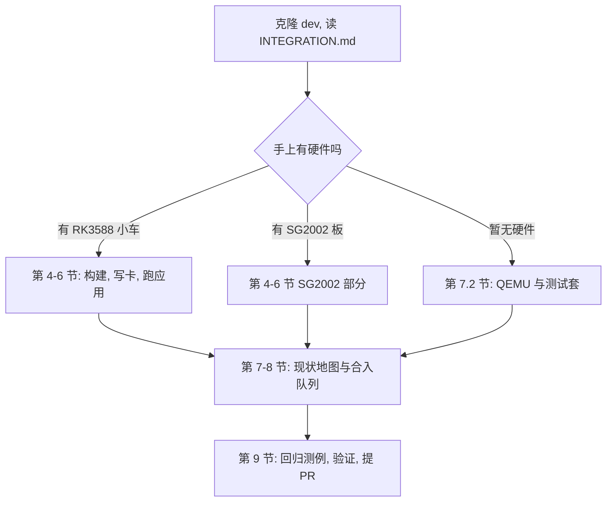
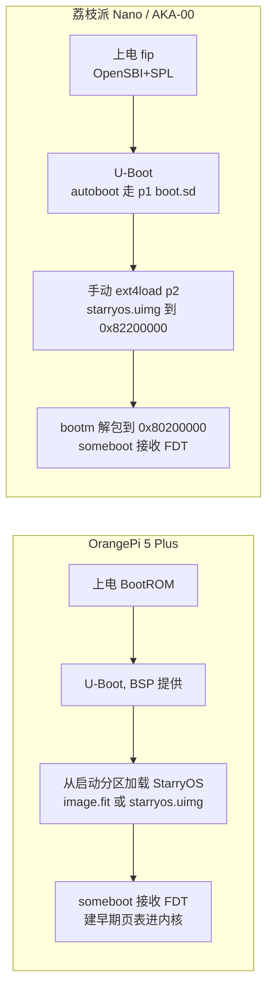

# 网球机器人开发者快速入门：RK3588 与 SG2002 平台

本文档面向接手网球机器人方向的后来开发者，覆盖从拿到小车硬件、构建并刷入内核、运行与验证应用，到定位优化点并回馈主线的完整路径，同时承担 Proj4 工作整理台账职能（第 8 章）。正文以 upstream `dev` 分支为读者基线：按本文走通主路径只需要 clone `dev` 就能获得的东西；不在 `dev` 上的增强材料集中登记在第 8 章的合入队列里。每个环节给出可直接执行的命令、涉及的代码位置与"跑通了"的判据。

> 事实基线：upstream `rcore-os/tgoskits` dev 主线。本文核对基于本地 dev 镜像 `3049b0c7be`（2026-08-25，落后 upstream 约 59 个提交，upstream 已至 `43750ad64d` 2026-09-06）；next 集成树核对至 `02d7b870f0`（2026-09-03）。标有【待验证】的步骤尚未经真机完整复现，执行时以实际输出为准，并把偏差反馈给维护者修订本文。

## 1. 总览与快速上手

### 1.1 项目定位与分支模型

tgoskits 是 ArceOS、StarryOS、Axvisor 的统一仓库，内核、驱动、组件、内存与虚拟化代码按层分目录复用。网球机器人方向对应操作系统功能挑战赛 Proj4"面向边缘智能的 AIOS"：在 StarryOS 上打通"摄像头采集 → NPU 推理 → 状态机决策 → 电机控制"闭环，并在过程中持续优化内核。仓库的分支模型决定你从哪里开始、往哪里提交：

| 分支 | 含义 | 规则 |
| --- | --- | --- |
| `dev` | upstream 主线（本文读者基线） | 所有合入经 PR，克隆即用 |
| `next` | 集成缓冲区：`dev` + 各源头分支已验证工作 | 可推倒重建，不在其上写独有代码，台账见 `INTEGRATION.md` |
| `feat/*` | 各功能源头分支 | 归开发者维护，`next` 从这里吸收 |

三层的日常动线是：从 `dev` 切出 `feat/*` 开发，验证后进 `next` 做集成测试，最终以 PR 合回 `dev`。接手后的第一个动作是浏览 `INTEGRATION.md` 了解 `next` 当前吸收了哪些尚未合入主线的工作，再按下图选择入口：



图中的三条入口最终汇合到同一条贡献路径：先跑通存量（确认环境与板卡正常），再看现状地图选一个不与主线重复的优化点，最后按工程纪律提交。

### 1.2 快速上手卡

以下三组命令分别对应两种硬件平台与无硬件场景，是全文的浓缩入口；每组命令只依赖 `dev` 上存在的资产。在你的开发机上进入仓库根目录执行。

RK3588（OrangePi 5 Plus）最小路径——编译内核后经串口送入 U-Boot 启动（无需拔卡写卡），应用层用 dev 上的 `orangepi-5-plus-uvc-rknn` 验证推理链路：

```bash
# 编译 StarryOS 内核（产物 target/aarch64-unknown-none-softfloat/release/ 下）
cargo xtask starry build -c os/StarryOS/configs/board/orangepi-5-plus.toml

# 一键通道：构建 + 经 U-Boot 串口加载启动（串口线 /dev/ttyUSB0, 波特率 1500000）
cargo xtask starry quick-start orangepi-5-plus build
cargo xtask starry quick-start orangepi-5-plus run --serial /dev/ttyUSB0
```

SG2002（荔枝派 Nano / AKA-00 车板）最小路径——编译后手工换镜像、写卡、U-Boot 手动引导（详见 5.2）：

```bash
# 编译（车板用 aka-00-sg2002.toml；WiFi 版用 licheerv-nano-sg2002-wifi.toml）
cargo xtask starry build -c os/StarryOS/configs/board/licheerv-nano-sg2002.toml

# 校验产物：Load/Entry 必须是 0x80200000
mkimage -l target/riscv64gc-unknown-none-elf/release/starryos.uimg
```

无硬件路径——在 QEMU 里启动并跑测试套，验证开发环境可用：

```bash
cargo xtask starry rootfs --arch aarch64
cargo xtask starry qemu --arch aarch64
cargo xtask starry test qemu --arch riscv64
```

三组命令的成功判据不同：两个硬件平台以串口出现 StarryOS shell 且应用验证标志出现为准（见第 6 节各表）；QEMU 路径以命令正常退出、测试套输出通过为准。

### 1.3 材料边界

`dev` 上已经具备走通主路径的全部内核侧资产（板级配置、构建体系、采集与推理应用、板级测试用例）。不在 `dev` 上的增强材料分三类：已验证待合入的 `next` 内容（aka-rk3588 demo 应用、THP/调度/快路径一批）、只在本地工作区的未提交材料（全流程 tennis 应用、本文档所在目录）、外部依赖（SG2002 小核固件、Linux 底包镜像）。三者清单、现状与去向建议统一登记在第 8 章，不在正文分散说明。

## 2. 硬件与启动链路

### 2.1 RK3588 小车构成

主控是 OrangePi 5 Plus（RK3588：8 核 4×A76+4×A55，NPU 6TOPS），整机由主控板、UVC 摄像头与三路执行器组成。执行器配置来自全流程 tennis 应用（目前为本地未提交材料，见 8.2）：底盘电机经 DRV8833 驱动、由 RK3588 的 PWM sysfs 四通道控制；另有 ESP32-C3 经 UART 挂接的底盘方案与 ZP10S 串行总线舵机机械臂，后端可在应用内按虚拟/真实切换。SD 卡上 Ubuntu rootfs 与 StarryOS 共享，应用资产预置在 rootfs 分区。

| 部件 | 接口 | 软件入口 |
| --- | --- | --- |
| 主控 OrangePi 5 Plus | 串口调试 `/dev/ttyUSB0` @1500000 | `os/StarryOS/configs/board/orangepi-5-plus.toml` |
| UVC 摄像头 | USB（MJPEG） | `apps/starry/orangepi-5-plus-uvc*`、EHCI/XHCI 驱动 |
| 底盘电机 DRV8833 | PWM sysfs 四通道 | tennis 应用执行器后端（8.2） |
| ESP32-C3 底盘 / ZP10S 舵机臂 | UART 串行总线 | tennis 应用执行器后端（8.2） |
| NPU | rknpu 驱动 | `drivers/npu/rockchip-npu`、`librknnrt.so` |

表中软件入口即开发时的落点：采集与推理问题看 `dev` 上的应用目录与 `drivers/` 对应驱动，控制问题看 tennis 应用执行器后端（该应用入库前，执行器参数以其仓库内 README 为准）。

### 2.2 SG2002 板构成

SG2002 是低成本入门平台（SOPHGO CV181x：大核 C906 RISC-V + 小核 C906L + CV181x TPU），有两种形态：荔枝派 Nano 裸板走"WiFi + USB 摄像头"链路（AIC8800 SDIO WiFi + UVC）；AKA-00 车板走"小核固件 + cvi 邮箱摄像头"链路，大核通过 `/dev/cvi-mailbox` 与小核交换帧数据。车板邮箱协议要点：握手 magic `0xC906C906`，DRAM 邮箱 `0x9004_0000`，YUV 帧缓冲 `0x8FE0_0000`，小核到主核 PLIC 中断 101；小核固件不在仓库内，需向 yfblock 索取。

| 形态 | 核心外设 | board toml | 应用 |
| --- | --- | --- | --- |
| 荔枝派 Nano | AIC8800 WiFi、USB 摄像头 | `licheerv-nano-sg2002.toml`（WiFi 版加 `-wifi`） | akars、uvc 相关 |
| AKA-00 车板 | cvi 邮箱摄像头、DWC2 USB | `aka-00-sg2002.toml` | akars、`aka00-tennis-yolo` |

两种形态共用同一构建体系（board toml 与 `.its`、`.dtb` 均在 `configs/board/`，已上游），只是 feature 组合与应用不同。`dev` 上 `test-suit/starryos/` 已注册两种形态的板级用例（`board-licheerv-nano-sg2002`、`board-aka-00-sg2002`）。

### 2.3 启动链路对比

两块平台的固件交接方式不同，这直接决定写卡时的分区布局与 U-Boot 引导命令。RK3588 上 U-Boot 由瑞芯微 BSP 提供，StarryOS 内核镜像放进启动分区即可；SG2002 上 p1 是 FAT（fip + dtb + 旧内核 `boot.sd`），p2 是 ext4 rootfs（StarryOS 内核在 `/starryos.uimg`），且 autoboot 默认加载的是旧内核，必须手动引导。



两个平台都由 `someboot` 引导层完成 U-Boot 到内核的交接（接收 FDT、设置早期控制台），内核本体是 PIE 链接的 StarryOS。差异集中在镜像格式与加载地址：RK3588 的 FIT 内核加载地址 `0x00400000`、FDT `0x0a100000`；SG2002 的 uimg 必须加载到 `0x82200000` 再解包到 `0x80200000`——把 uimg 直接放在解包目标地址会自覆盖，这是最常见的引导错误之一。

### 2.4 待补硬件信息

接线图、供电规格、相机安装参数等尚未进入仓库文档，需要硬件同学补充。当前挂起的问题清单：相机型号与安装高度/俯角；底盘电机与 DRV8833 的接线定义；ESP32-C3 与 ZP10S 舵机的串口参数与限位；整机供电电压电流与急停方案。这些信息到位后回填本节，形成完整的硬件章节。

## 3. 环境准备

### 3.1 容器环境

仓库推荐用官方容器跑构建，免去工具链与依赖问题，SG2002 的 riscv64 musl 交叉编译尤其依赖它（宿主机通常没有该工具链）。进入仓库根目录后：

```bash
docker pull ghcr.io/rcore-os/tgoskits-container:latest
docker run --rm -it -v "$PWD":/workspace -w /workspace \
  ghcr.io/rcore-os/tgoskits-container:latest
```

容器内可直接使用 `cargo xtask` 全部命令族。挂载参数按你的仓库位置调整；镜像更新随 CI `container-publish.yml` 发布。

### 3.2 本机环境

不用容器时需要自行准备 Rust 工具链与 QEMU：仓库固定使用 Rust 2024 nightly（由 `rust-toolchain.toml` 锁定，进入仓库自动切换）与 QEMU 10.2.1（推荐版本）。仓库中的 Python 脚本一律用 `python3` 运行，系统自带的 `python` 是 Python 2。

```bash
# Debian/Ubuntu 依赖
sudo apt install qemu-system-arm qemu-system-riscv64 qemu-system-x86 \
  gcc-aarch64-linux-gnu gcc-riscv64-linux-gnu cargo-binutils u-boot-tools
# Rust 工具链由 rust-toolchain.toml 锁定, rustup 会自动安装
rustup show
```

`u-boot-tools` 提供 `mkimage`，是校验/生成 uimg 的关键工具。macOS 可用 `brew install u-boot-tools qemu`【待验证：当前主要在 Linux 与容器上验证】。

### 3.3 环境自检

环境是否就绪用一条 QEMU 启动判断——不需要任何硬件。先生成 rootfs 再启动 StarryOS：

```bash
cargo xtask starry rootfs --arch aarch64
cargo xtask starry qemu --arch aarch64
```

QEMU 窗口/串口出现 StarryOS shell 且进程正常退出或可交互，即环境可用。若这一步失败，问题在工具链或 QEMU 版本，与板卡无关；对照仓库 `README.md` 的环境章节排查后再继续。

## 4. 内核构建

### 4.1 构建配置机制

理解 `xtask` 的配置机制能避免"改了配置没生效"这类最高频的坑。`os/StarryOS/configs/board/` 下的 board toml 是模板：`cargo xtask starry build -c <toml>` 显式使用它；不带 `-c` 时回落到持久化的构建配置副本（`target/.axbuild/config/starryos/build-<target>.toml`），该副本由 `write_defconfig()` 从模板复制生成（实现见 `scripts/axbuild/src/starry/config.rs`）。因此修改 board toml 后必须重新带 `-c` 构建（或重新 defconfig），否则生效的还是旧副本。

另有两个隐式行为：构建时 `enable_starry_smp_capability` 无条件注入 `smp` feature，toml 里的 `max_cpu_num` 只是运行期暴露的 CPU 数上限而非开关；内核按 PIE 链接，加载地址由引导阶段决定。板级差异全部通过 toml 的 features 表达（如 `ax-driver/rk3588-pcie`、`rknpu`、`ax-driver/cv181x-sdhci`），新增板级能力优先加 feature 而不是改代码路径。

### 4.2 RK3588 构建

标准构建命令与产物校验如下；该命令在集成树 2026-09-03 轮验证通过（`docs/tgoskits-next/report-2026-09-03.md`）：

```bash
cargo xtask starry build -c os/StarryOS/configs/board/orangepi-5-plus.toml
ls -lh target/aarch64-unknown-none-softfloat/release/
```

uimg 由构建系统发现与 toml 同名的 `.its` 模板后调用 `mkimage` 生成（`scripts/axbuild/src/starry/build.rs`）。注意一个已知缺口：`configs/board/` 下没有 `orangepi-5-plus.its`（dev 与 next 均无，三个 `.its` 都属于 SG2002），uimg 生成依赖持久化 defconfig 中的副本——若构建未产出 uimg，说明 `.its` 缺失，此时可直接使用 `starryos.bin` 组装 FIT。该缺口已列入 8.2 合入队列（恢复 `.its` 入库）。

### 4.3 SG2002 构建

三个 board toml 对应三种配置：裸板 `licheerv-nano-sg2002.toml`、加 WiFi 的 `-wifi` 变体、车板 `aka-00-sg2002.toml`（额外启用 cvi 摄像头与 DWC2 USB）。`os/StarryOS/Makefile` 提供快捷目标：

```bash
cargo xtask starry build -c os/StarryOS/configs/board/licheerv-nano-sg2002.toml
# 或快捷方式: make sg2002 / make sg2002-wifi（在 os/StarryOS/ 下）
mkimage -l target/riscv64gc-unknown-none-elf/release/starryos.uimg
```

`mkimage -l` 的输出里 Load/Entry 必须都是 `0x80200000`；若为 0 说明 `.its` 解析失败，产物无法引导（对应 10.2 的 EPC=0 故障）。

### 4.4 应用程序构建

`xtask` 只部署内核，用户态应用需要单独构建并预置到 rootfs。两个平台的方向相反：RK3588 的 C++ 应用（uvc-rknn 等）需要 glibc aarch64 交叉工具链，不要用 musl（依赖 `GLIBC_2.34`）；SG2002 的 akars 需要 riscv64 musl 静态编译（容器内进行），且要把它默认的 xthead 加载器改为标准 `/lib/ld-musl-riscv64.so.1`。各应用的构建入口：

```bash
# RK3588 应用（各 app 目录内）
./build-image-runner.sh          # 交叉编译并 rsync 安装（uvc-rknn）

# SG2002 akars（容器内）
cargo build --release --target riscv64gc-unknown-linux-musl
```

具体部署路径与验证标志见第 6 节两张应用表。

## 5. 手工写卡与上板

### 5.1 通用原则

两个平台的"换内核"都是替换启动介质上的镜像文件，不动固件：SG2002 的 fip（含 SDIO PHY 等底层初始化）与 RK3588 的 U-Boot 都保持底包原样，只换 StarryOS 内核镜像。写卡操作的三条铁律：任何写入后 `sync` 并安全弹出再断电（跳过 sync 硬断电会损坏 ext4 rootfs，修复流程见 10.2）；优先写 FAT 分区而非 ext4（降低损坏面）；保留一份可启动的底包镜像，坏了直接重刷整卡而不是在坏卡上叠写。

| 平台 | 底包 | 换什么 |
| --- | --- | --- |
| SG2002 | 现成 SD 镜像（`sdcard_akars.img` 等，p1 FAT + p2 ext4） | p2 的 `/starryos.uimg` |
| RK3588 | OrangePi Ubuntu 底包（`ubuntu-22.04-...orangepi-5-plus.img.xz`） | 启动分区的 StarryOS 镜像（FIT/uimg） |

底包镜像属于外部资产不入库（见 8.2），获取方式：SG2002 向维护者索取现成镜像或从 vendor 底包自制；RK3588 用 OrangePi 官方 Ubuntu 镜像。

### 5.2 SG2002 流程

流程要点如下（历史上有一份更完整的实操手册，当前待归档，见 8.2）。先在 Linux 或 `--privileged` 容器里挂载镜像换内核，再整卡写入 SD：

```bash
# 1. 挂载镜像 p2 并替换内核
LOOP=$(losetup -f --show -P sdcard_akars.img)
sudo mount ${LOOP}p2 /mnt
sudo cp target/riscv64gc-unknown-none-elf/release/starryos.uimg /mnt/starryos.uimg
sync && sudo umount /mnt && sudo losetup -d $LOOP
# 备选（无 losetup 权限时）: mount -o loop,offset=16777728 sdcard_akars.img /mnt

# 2. 整卡写入（设备名按实际改！macOS 用 /dev/rdiskN, bs=4m）
sudo dd if=sdcard_akars.img of=/dev/sdX bs=4M conv=fsync status=progress
```

上电后中断 autoboot 进入 U-Boot 命令行手动引导（无 `saveenv`，每次重启都要敲）：

```bash
fatload mmc 0:1 0x81000000 cv181x.dtb
ext4load mmc 0:2 0x82200000 /starryos.uimg
bootm 0x82200000 - 0x81000000
```

三个地址不可改：uimg 加载到 `0x82200000`、解包目标 `0x80200000`、dtb 在 `0x81000000`。若 p1 没有 dtb，可用 U-Boot 自带的 `bootm 0x82200000 - $fdtcontroladdr` 兜底。autoboot 走的 `boot.sd` 是旧内核，"重启后又变回去了"不是 bug 而是这条默认链路。

### 5.3 RK3588 流程

RK3588 采用手工写卡：以 OrangePi Ubuntu 底包为基础整卡写入，替换启动分区中的 StarryOS 镜像。启动介质上的 FIT 结构为 kernel（load `0x00400000`）+ FDT（load `0x0a100000`）：

```bash
# 1. 解压并整卡写入底包
xz -d ubuntu-22.04-preinstalled-server-arm64-orangepi-5-plus.img.xz
sudo dd if=ubuntu-22.04-....img of=/dev/sdX bs=4M conv=fsync status=progress

# 2. 挂载启动分区, 替换 StarryOS 镜像【待验证: 底包默认引导的文件名与引导脚本】
#    (FAT 分区; 将构建产物组装为 image.fit 后覆盖同名文件)
sync

# 3. 挂载 rootfs 分区, 预部署应用资产 (见 6.1 表), sync 后弹出
```

第 2 步是当前唯一未闭环的环节：底包 U-Boot 具体加载哪个文件（`image.fit`、uimg 还是 extlinux 配置）需要在首次复现时确认并回填本文。免写卡的替代路径有两条：`cargo xtask starry quick-start orangepi-5-plus run --serial /dev/ttyUSB0` 经串口把内核送进 U-Boot（日常开发推荐，改一次跑一次）；以及经 ostool 板卡服务的 `cargo xtask starry test board --board orangepi-5-plus`（需 `OSTOOL_SERVER`/`OSTOOL_PORT`，用于跑注册的板级测试用例）。注意带 eMMC 的板子上 SD 卡通常是 `mmc 1`，U-Boot 命令里的设备号以实际枚举为准【待验证】。

### 5.4 板卡分区布局备查

两块板的分区布局与关键文件汇总如下，写卡与排查时对照：

| 平台 | 分区 | 内容 | 备注 |
| --- | --- | --- | --- |
| SG2002 | p1 FAT | `fip.bin`、dtb、`boot.sd` | fip 勿换：与板型绑定，换错致 WiFi CRC 错 |
| SG2002 | p2 ext4 | Alpine rootfs、`/starryos.uimg`、应用 | 损坏风险区，写入必 sync |
| RK3588 | 启动分区 | U-Boot、StarryOS 镜像（FIT/uimg） | 替换目标【待验证文件名】 |
| RK3588 | rootfs 分区 | Ubuntu rootfs、应用资产 | 与 Linux 共享，应用预置于此 |

SG2002 的 fip 与板型强绑定：荔枝派 Nano 的 fip 为 440832 字节（sha1 `5b4d1faf…`），换板必须连 fip 一起换，否则 WiFi 大包失败（PHY 采样延迟由 fip 决定）。

## 6. 应用运行与验证

### 6.1 RK3588 应用

四个应用构成从采集到全流程的阶梯，注意它们的分支位置不同：前两个在 `dev` 上，aka demo 在 `next`，全流程 tennis 应用还在本地工作区（未提交，见 8.2）。验证标志是判断"跑通了"的客观判据（板级 CI 也用这些正则）：

| 应用 | 位置 | 功能 | 部署路径 | 验证标志 |
| --- | --- | --- | --- | --- |
| `orangepi-5-plus-uvc` | dev | libuvc MJPEG 采集与帧率统计 | rootfs，会话文件下发 | 帧率/吞吐输出 |
| `orangepi-5-plus-uvc-rknn` | dev | UVC → YOLOv8 推理 → HTTP MJPEG | `/rknn_yolov8_image` | `YOLO_RESULT` |
| `aka-rk3588` | next（#1976） | 预编译 tennis YOLO demo | `/home/orangepi/robot/aka-rk3588` | `AKA_RK3588_DEMO_PASSED` |
| `orangepi-5-plus-tennis` | 本地工作区 | 捡球全流程 + 帧到指令延迟基准 | `/tennis_app` | `TENNIS_BENCH_RESULT` |

`dev` 上的最小推理验证从 `orangepi-5-plus-uvc-rknn` 开始：先把 `/rknn_yolov8_image`（含推理程序、`librknnrt.so`、`librga.so`、模型）预置进 rootfs，启动后看到 `YOLO_RESULT` 输出即采集到推理的链路正常。采集单项用 `orangepi-5-plus-uvc`。aka demo 与全流程 tennis 需要分别等 `next` 合入与本地应用入库（见第 8 章），届时可分别用 `AKA_RK3588_DEMO_PASSED` 与 `TENNIS_BENCH_RESULT` 验收。注意完整捡球流程（aka 的 `run_lekiwi_full.sh`）在 Linux 下手动跑。

### 6.2 SG2002 应用

SG2002 的应用围绕 akars 服务与 TPU 校验组织。`akars` 是静态链接的 Rust 服务端（外部项目，容器内 musl 静态编译后部署），跑起来后手机连板子热点即可访问 `http://<板IP>:8080`：

```bash
akars serve --listen 0.0.0.0:8080 --motor /dev/ttyS1 --arm /dev/ttyS2 \
  [--camera /dev/cvi-usb-camera0]
```

设备名只有 `ttyS1`/`ttyS2` 存在（akars 默认 README 里的 ttyS3 是错的），且别占用 ttyS0 控制台。

| 应用 | 位置 | 功能 | 部署路径 | 验证标志 |
| --- | --- | --- | --- | --- |
| akars | 外部项目 | Web 遥测 + 电机/相机服务 | `/root/`、`/usr/local/bin/` | HTTP 可访问、电机响应 |
| `aka00-tennis-yolo` | dev（#1530/#1594） | 固定图 YOLO TPU 推理校验 | `/akars_tennis` | `AKARS_TENNIS_VALIDATE_PASS images=3` |
| `aka00-cvi-mailbox` 等 | `feat/yfblock-oscomp-port` | 小核邮箱/YUV/RGB 校验工具 | 板上各路径 | 各自输出 |

`aka00-tennis-yolo` 是 `dev` 上 SG2002 的"推理链路自检"：不接摄像头，用预置图片验证 CV181x TPU 推理正确性，输出 `AKARS_TENNIS_VALIDATE_PASS` 即通过。WiFi 链路用 `-wifi` 变体 toml 构建，AIC8800 固件在构建时按 pinned commit 自动下载校验，无需手工放置。cvi 邮箱三件套工具受小核固件外部依赖阻塞，暂留分支（见 8.2）。

### 6.3 板上访问与文件传输

板卡运行期的访问通道两块平台各有两条：串口（救砖与引导必经）与 SSH（日常文件与命令）。板上没有 scp/sftp-server，传文件用 cat 管道：

```bash
# 传文件（SG2002 例）
cat akars | ssh root@<板IP> 'cat > /root/akars && chmod +x /root/akars'
# SSH 连不上先清 host key
ssh-keygen -R <板IP>
```

| 通道 | RK3588 | SG2002 |
| --- | --- | --- |
| 串口 | `/dev/ttyUSB0` @1500000 | `/dev/ttyUSB0` @115200 |
| 网络 | Ubuntu rootfs 的 SSH | 板连热点（IP 随热点变）或板作热点 |
| IP 获取 | rootfs 内 `ip addr` | SSH 不通时串口进 shell 查 `ip addr` |

SG2002 的 IP 随所连热点变化，"昨天能连今天连不上"先怀疑 IP 变了而不是系统坏了；串口永远是最后兜底。

## 7. 内核开发现状

### 7.1 已在 dev 的能力

接手优化前先查这张表，避免重做已上游化的工作（各队决赛报告里大量"自研"实为旧基线重复实现）。以下条目均已核对存在于 dev 镜像（PR 号 + 证据提交）：

| 子系统 | 内容 | 证据 |
| --- | --- | --- |
| NPU | rknpu GEM 管理、cache flags | #1364（`034af5c6bd`），`drivers/npu/rockchip-npu` |
| 图像加速 | RGA 2D 加速 + dma-heap | #1388（`08eca7d04b`） |
| 图像加速 | JPEG 硬解 VDPU720 | #1456（`464bd91478`） |
| 板级 | RK3588 PWM sysfs、ondemand DVFS | #1468（`261630b85f`）、#1657（`d3e2aef5c7`） |
| 调度 | sched-family 测试套、跨核唤醒延迟 | #986（`2dd0d2dee9`）、#1495（`1fa8b95f4c`） |
| 网络 | rtnetlink IPv4 配置 | #1497（`882e07fd2d`） |
| SG2002 | cvi-vdec JPEG 回放链路、AKA-00 YOLO 板测 | #1594（`4ed7f1d81a`）、#1530（`d803ca8c92`） |
| 配置与测试 | 双平台全套 board toml/.its/.dtb、`test-suit` 板级用例 | `configs/board/`、`test-suit/starryos/board-*` |

核对方法是双重的：PR 编号给出来龙去脉，代码位置用于在现树上确认（例如 `drivers/npu/rockchip-npu/src/gem.rs` 的 `GemPool`）。计划做某子系统优化时，先读对应模块现状再立项；2026-08 之后的调度/THP/快路径改进不在 dev，在 `next` 待合入（见 8.1）。

### 7.2 无硬件开发路径

没有板卡也能推进大部分内核工作，三层验证通道按成本递增：QEMU 系统测试、host 单元测试、内核 ktest。测试套按 `<case>/qemu-<arch>.toml` 组织在 `test-suit/starryos/`（发现规则见其 `GUIDE.md`）：

```bash
cargo xtask starry test qemu --arch riscv64   # 全量
cargo xtask starry test qemu -l               # 列出用例
cargo xtask starry test qemu -c qemu/system   # 单用例
cargo xtask ktest qemu -p starry-kernel --arch riscv64
cargo xtask test                              # std 白名单单测 (scripts/test/std_crates.csv)
```

host 单元测试分散在各 crate 的 `tests/`（如 `memory/page-table-generic/tests`、`components/axsched`）与内核内嵌 `mod tests`。写回归测例时优先选这三层里最低的一层——能在 host 单测里确定性复现的 bug 不必上 QEMU，能上 QEMU 的不必等板卡。NPU 相关改动的无板验证可参考 Posad 的 QEMU RKNPU 功能级仿真（`processmission/qemu` PR #19，外部仓库）。

## 8. Proj4 工作整理与合入队列

本章是 Proj4 收尾的整理台账：登记每一项工作的当前位置、验证状态与建议去向，供接手者直接领任务。状态分三档——已在 `dev`（见 7.1，无需动作）、在 `next` 待合入、未入库待拍板；另有其他队伍候选一条接续线。

### 8.1 在 next 待合入 dev

`next`（`02d7b870f0`，2026-09-03）领先 dev 镜像 108 个提交，按主题归组如下。合并前注意两点：本地 `next` 领先 fork 上的 `origin/next` 42 个提交（含合并残迹修复 `02d7b870f0`），需先 push 并过 T0/T1 复验；分批合入时按主题拆 PR，进度记入 `INTEGRATION.md`。

| 主题 | 内容与证据提交 | 量级 |
| --- | --- | --- |
| 应用与基准 | aka-rk3588 预编译 demo #1976（`9063198d91`）、sysbench big.LITTLE 基准与 RK3588 板级 harness（`cf836cfb13`） | 2 项 |
| 驱动 | crab-usb HCD 生命周期 #1980（`106bede307`）、sdmmc Rockchip reset #1987（`56f8bfc820`）、rdrive 三项 #2002/#2003/#2004（`ab2595bea1`/`852315ea7b`/`69470c2f2c`）、rknn JPEG 失败安全 #2041（`87c2fe0189`）、axvisor rockchip-dwmmc #2164（`aa9857b7bb`）、UART 有界运行时 #2076（`3bd81b06c5`）、DWC2 host 拆分（`54adcc2945`） | 约 25 提交 |
| 调度与 SMP | capacity-aware 大小核摆放（`d66a5e4769`）、per-cpu capacity 表（`76a81f4ce7`）、per-thread CPU 时间 SMP 化（`7e483ea94a`）、sched 内省 #1989（`a3868568b1`） | 约 27 提交 |
| 内存与 THP | 匿名大块 THP（`6b182e807a`）、THP 2M→4K split（`f55c25b4ba`，正文引 #1990）、break-before-make 大页切分（`763222dac4`）、中间页表回收前 invalidate（`25331b14ed`）、THP 驻留计数（`29672b1138`）、mremap 4K ABI（`f2112f07ae`）、buddy split_pages（`8c6112ee10`） | 约 28 提交 |
| 系统调用快路径 | futex 表分片 #1997（`01fe18e238`）、sys_write 去冗余 #1998（`4504a04772`）、seccomp 快路径 #1999（`f9e8b9dd79`）、无 timer 进程跳过 poll（`3be2bf125a`） | 约 17 提交 |
| 测试 | TimeManager 契约 #2010/#2012（`e53e59442f`/`fdc7556f0c`）、THP QEMU 测试（`eed8397f2b`/`413cda67c7`）、sysbench harness 修复群 | 约 28 提交 |

另有一批编号存疑待复核：#2008/#2009/#1656/#1577/#1601-1603 在本地所有分支的提交信息中查无引用（页表/TLB 工作实际以上表无编号提交落地；#2010 实为 TimeManager 测试）。这批编号可能来自在审或未合并的 PR，合入排期前先到 GitHub PR 页面复核真实状态。

### 8.2 未入库材料与去向建议

以下材料未提交到任何分支（纯工作区或历史 WIP），是 Proj4 整理的主要待办。每项给出建议去向，落地时按第 9 章流程走：

| 材料 | 现状 | 建议去向 |
| --- | --- | --- |
| `docs/tennis-robot-guide/`（本文档及评审文档） | 工作区未提交 | 整理后 PR 进 dev（文档批可先行） |
| SG2002 实操手册（licheerv 全流程文档） | 已丢失（工作区清理时误删） | 从维护者备份或本文内联要点重建后入库 |
| `apps/starry/orangepi-5-plus-tennis/` | 工作区，任何分支均无 | 先提交进 `next` 集成验证；上游化前按 aka-rk3588 的 `source.env` 校验模式处理二进制与模型 |
| `os/StarryOS/configs/board/orangepi-5-plus.its` | dev/next 均缺（uimg 生成缺口，见 4.2） | 从构建产物恢复并入库，独立小 PR |
| image.fit 组装流程 | 脚本未入库 | 与 `.its` 方案一并脚本化进 `scripts/` |
| `aka00-{cvi-mailbox,yuv-fps,rgb-check}` | 仅在 `feat/yfblock-oscomp-port` 分支 | 阻塞于小核固件不可分发，维持分支不动 |
| 底包镜像、固件二进制 | 本地/外部 | 不入库，在文档中登记获取方式（见 5.1） |
| 各队决赛报告原件 | `~/Downloads/附件下载_Proj4 每周同步共享文档/`（含 zip 备份） | 永不提交进 git；整理工作以它为依据 |

表中前四项是文档与应用两条入库主线；`.its` 与 image.fit 两项是 blocking 级小缺口——不补则 RK3588 的 uimg 生成不可复现。

### 8.3 其他队伍候选

决赛五队的评审结论（YatSenOS、火锅宇泡面、大象飞出冰箱外、重返未来、Posad 对照）筛出 15 项合并候选（C01-C15），其中 P0 六项建议优先评估。详细判定、证据与页码见本目录评审文档 `proj4-peer-teams-final-review.md`：

| 编号 | 内容 | 来源 | 净内容一句话 |
| --- | --- | --- | --- |
| C01 | dma-heap cacheable + 方向化 cache 维护 | YatSenOS | CPU 读加速器内存 150ms→6ms，dev 上疑似净新增 |
| C02 | 优先级分层 RR + 优先级感知唤醒抢占 | 火锅宇泡面 | dev 的 round_robin 仍是单队列+priority 桩，机制净新增 |
| C03 | rknpu 三核并发提交（`4505b19`） | 大象 | 核状态机+5 槽双索引，需与 #1364 线 diff |
| C04 | rknpu ABI 错误严格化 + MemSync 真实现（`cad4e79`） | 大象 | submit 错误透传、sync 按 obj_addr 反查 |
| C05 | 同页双缺页竞态修复 | 大象 | PTE 查证+单页 TLB 重试，小而独立，适合首个落地 PR |
| C06 | rsext4 写回显式化 | 重返未来 | close 数秒→毫秒，需补掉电一致性评审 |

接手候选的标准流程：向原作者要 fork 与基线 → 三点 diff 取净变更（不能整分支合）→ 在最新 dev 上重做 A/B → 补确定性回归测例 → 提 PR。P1/P2 级候选与方法论沉淀见评审文档完整清单。

### 8.4 建议推进顺序

综合验证状态与依赖关系，建议的推进顺序如下；每步的验证要求见第 9 章，对外动作（push、PR）先与维护者确认：

1. **push `next` 并过 T0/T1**：42 个本地提交未推，合入队列全部以此为前提。
2. **文档批入库**：本文档与配套指南、SG2002 实操手册恢复，PR 进 dev。
3. **小缺口修复**：`orangepi-5-plus.its` 恢复入库、image.fit 组装脚本化（解除 RK3588 uimg 不可复现问题）。
4. **next→dev 分批合入**：按 8.1 六个主题拆 PR（驱动/内存/调度/快路径/测试/应用），每批带回归证据。
5. **存疑编号复核**：8.1 末列的 PR 号到 GitHub 复核，确认在审/未合并状态后重排计划。
6. **候选接续**：按 8.3 流程从 C05 开始落地。

## 9. 贡献流程与工程纪律

### 9.1 修改与验证铁律

仓库的验证入口统一走 `cargo xtask`，直接用原生 `cargo build/test/clippy` 跑 ArceOS/StarryOS 属于违规。修改代码后的固定动作序列：先写确定性回归测例并验证它在当前实现上失败，再实现修复并验证同一测例通过（AGENTS.md 铁律，禁止只做事后验证或放宽测试）；然后 `cargo xtask clippy --package <包>` 定向检查、`cargo fmt` 格式化；不得用 `allow` 属性压警告，修根因。

三条编码规范按语义触发、必读全文：`docs/guideline/code-quality.md`（任何写/改/审代码前）、`docs/guideline/feature-development.md`（新增功能或硬件能力）、`docs/guideline/starry_syscall.md`（影响用户可见的 syscall/Linux ABI 语义时，含间接影响）。解决合并冲突时不手工合并 `Cargo.lock`，先解其他冲突再让 Cargo 重新生成并校验锁文件。

### 9.2 验证层级与集成树

集成树流程把验证分成三层，提交前对照自己改动的影响面选择要过的层：

| 层 | 内容 | 执行方式 |
| --- | --- | --- |
| T0 | 受影响配置的 Docker 全量编译 | `scripts/t0-build.sh` 等脚本 |
| T1 | QEMU + 单元 + std + starry 测试套 | CI 与本地 `cargo xtask` 可复现 |
| T2 | 实板功能验证 | 手工/板卡服务 |

`next` 的重建与吸收流程（dev 快进 → 重建 → 逐分支 merge 记账 → T0/T1 → 打 tag → 更新 `INTEGRATION.md`）定义在 `docs/tgoskits-next/README.md`。源头分支与集成树的分工是：fix 与 feat 都在 `feat/*` 上做，`next` 只做集成验证，冲突回源头分支解决。

### 9.3 提交 PR

PR 面向 upstream `dev`，格式遵循约定式提交：标题 `type(scope): content` 且用英文，正文用中文并说明解决的问题、实际改动、每步方案逻辑；分支新增提交后同步更新 PR 描述。提交前尽可能本地跑完整 CI 流程（实体板与自托管项除外）；纯文档改动豁免。两个禁区：不得在 PR 中加入 agent/AI 相关标签或宣传性措辞；push 与对外动作前先与维护者确认。审查侧的配套工具是 `.claude/skills/` 下的技能（`review-single-pr`、`starry-test-suit`、`cross-kernel-driver`、`arch-platform-porting` 等，全量清单见 `AGENTS.md`），它们同时定义了代码要过审的设计约束。

## 10. 排障速查

### 10.1 构建与配置

构建期问题多数指向配置机制（见 4.1）。下表汇总最高频的几类：

| 症状 | 原因 | 处理 |
| --- | --- | --- |
| 改了 board toml 但行为没变 | 不带 `-c` 用了持久化旧副本 | 重新 `build -c <toml>` |
| `max_cpu_num` 改了核数没变 | SMP 由构建强制注入，该值只是上限 | 核数由引导参数/平台决定 |
| SG2002 构建无 uimg 只有 bin | `.its` 缺失或未被复制 | 确认同目录 `.its`，重新 defconfig |
| 应用跑不起来缺 `GLIBC_2.34` | 用 musl 工具链编了 RK3588 应用 | 换 glibc aarch64 交叉工具链 |
| akars 起不来缺 loader | xthead loader 残留 | 改为 `/lib/ld-musl-riscv64.so.1` |

构建失败先确认自己在容器或齐备的本机环境里（第 3 节），再看是否踩了上表配置类问题，最后才怀疑代码。

### 10.2 刷机与启动

启动期故障沿启动链路定位：串口有输出卡在 U-Boot 是引导命令问题，进了内核 panic 是内核/驱动问题，串口无输出是介质或固件问题。

| 症状 | 原因 | 处理 |
| --- | --- | --- |
| `bootm` 后 EPC=0 / Instruction access fault | uimg Load/Entry 为 0（its 解析失败） | `mkimage -l` 校验后重编 |
| SG2002 引导后内核自覆盖 | uimg 加载地址写成了 0x80200000 | 必须加载到 0x82200000 |
| 重启后回到旧内核 | autoboot 走 p1 `boot.sd` | 每次手动引导，见 5.2 |
| 串口乱码 | 波特率错或 fip 与板型不匹配 | 核对 115200/1500000 与 fip 身份 |
| rootfs mount 失败/文件消失 | 写后未 sync 硬断电致 ext4 损坏 | 重刷整卡；预防见 5.1 |

SG2002 上反复写坏 rootfs 时不要继续叠写，直接重刷底包再换内核；已有损坏的卡若还需抢救，参考 `board-uboot-fsck-repair` 技能的 U-Boot fsck 流程。

### 10.3 板上运行

运行期问题多与设备枚举和网络相关：

| 症状 | 原因 | 处理 |
| --- | --- | --- |
| `ttyS3` 不存在 | SG2002 只注册 ttyS1/ttyS2 | 改用存在的设备号，避开 ttyS0 |
| SSH 连不上 | IP 随热点变化或 host key 变更 | 串口查 `ip addr`；`ssh-keygen -R` |
| WiFi 大包失败/CRC 错 | fip 与板型不匹配 | 换回对应板的 fip（见 5.4） |
| NPU demo 失败 | rootfs 资产缺失或未 sync | 对照 6.1 表补齐预置 |
| 传文件没有 scp | 板上无 sftp-server | 用 6.3 的 cat 管道 |

仍无法定位时，串口全程日志 + 复现步骤是求助的最小信息集；内核日志被 shell 掐断的场景参考维护者已知的 console 输出问题排查记录。

## 11. 资源索引

以下材料构成这个方向的完整知识地图，按用途组织。优先读前两行（环境与快速入门），做内核优化前读评审材料与集成台账，写代码前读规范：

| 材料 | 位置 | 用途 |
| --- | --- | --- |
| 仓库 README | `README.md`、`README_CN.md` | 环境与三条系统路径入口 |
| 快速入门（官方） | `docs/docs/quickstart/starryos.md` | xtask 命令与板测通道细节 |
| 集成树台账 | `INTEGRATION.md`、`docs/tgoskits-next/` | next 状态与 T0/T1/T2 流程 |
| 测试套指南 | `test-suit/starryos/GUIDE.md` | 用例发现与增改规则 |
| 编码规范 | `docs/guideline/` 三份 | 写码前按语义必读 |
| 贡献与技能 | `os/StarryOS/CONTRIBUTING.md`、`.claude/skills/` | 行为准则与审查工具 |
| Proj4 各队决赛评审 | `proj4-peer-teams-final-review.md`（本目录） | 候选合并队列与现状判定 |
| Posad 决赛报告 | 仓库外材料 | 优化方法论与上游化过程 |

本文档是活文档：复现中发现的偏差（尤其【待验证】项）请直接修订对应小节并更新事实基线中的核对日期，让下一位开发者拿到的是修正过的路径。
